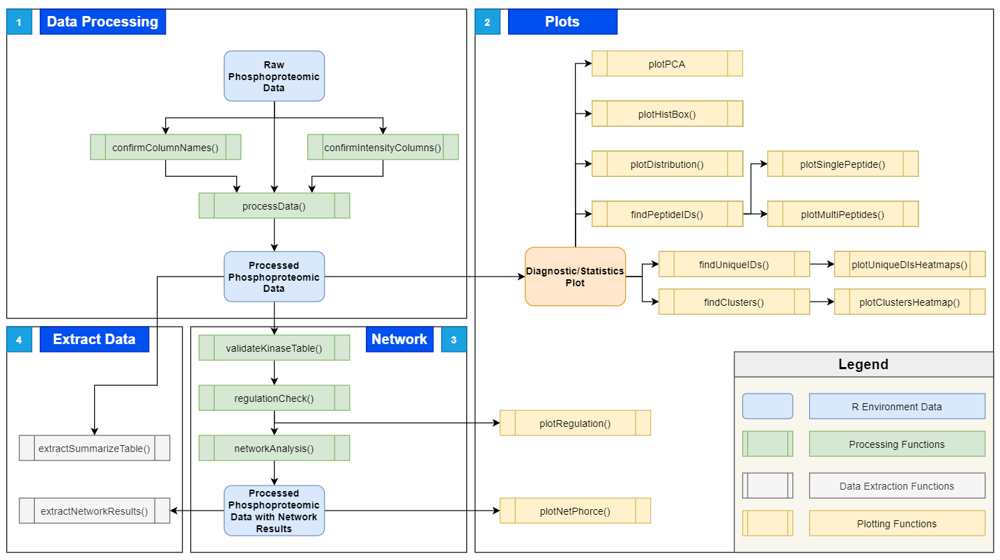

# NetPhorce 

<!-- badges: start -->

The NetPhorce Package provies tools to performs data filtering steps, quality control, statistical analysis, data visualization, and network inference for phosphoproteomics data. Phosphorylation of proteins can regulate their turnover and activity, and phosphorylation at different sites can facilitate distinct programs of regulations. Studying phosphorylation relays in a network is thus important to understand plant responses, however downstream analyses, including data-driven network inference, is still a bottleneck. 
Please check out the [NetPhorce Website](https://ksong4.github.io/NetPhorce/) to see guides and tutorials for NetPhorce.

## Install from GitHub
```r
install.packages("devtools")
devtools::install_github("ksong4/NetPhorce")
```

## NetPhorce Function Structure


## NetPhorce Tutorials 
- [Data Processing Tutorial](https://ksong4.github.io/NetPhorce/articles/NetPhorce.html)
- [Plotting Tutorial](https://ksong4.github.io/NetPhorce/articles/rMD_V2_TwoConditionDemonstrationWithPlots.html)
- [Data Extraction Tutorial](https://ksong4.github.io/NetPhorce/articles/rMD_V3_DataExtractionTutorial.html)
- [NetPhorce Shiny to R](https://ksong4.github.io/NetPhorce/articles/rMD_V4_ShinyToR.html)

